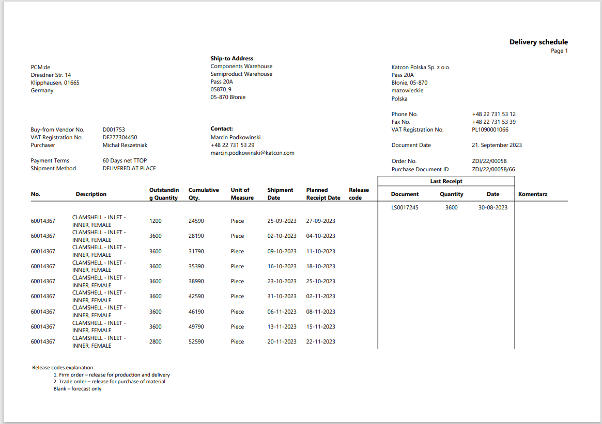
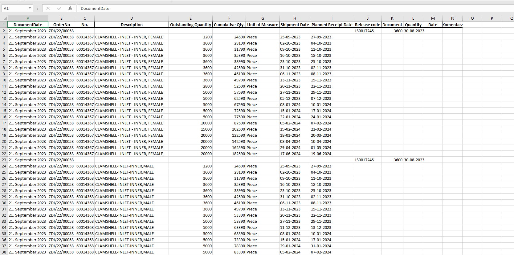

*Kerakli kutubxonalarni o'rnatamiz*

        pip install -r requirements.txt

*test.pdf fayldagi table datalarni o'qib, o'sha dataga biroz ishlov beradi*

pdf ushbu ko'rinishda bo'ladi:

va dastur uni pdf fayldan excel faylga o'tkazib, ushbu ko'rinishda beradi

